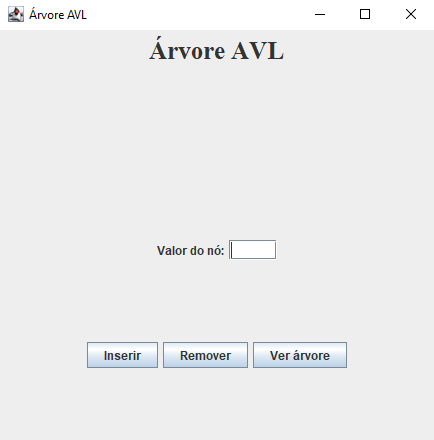
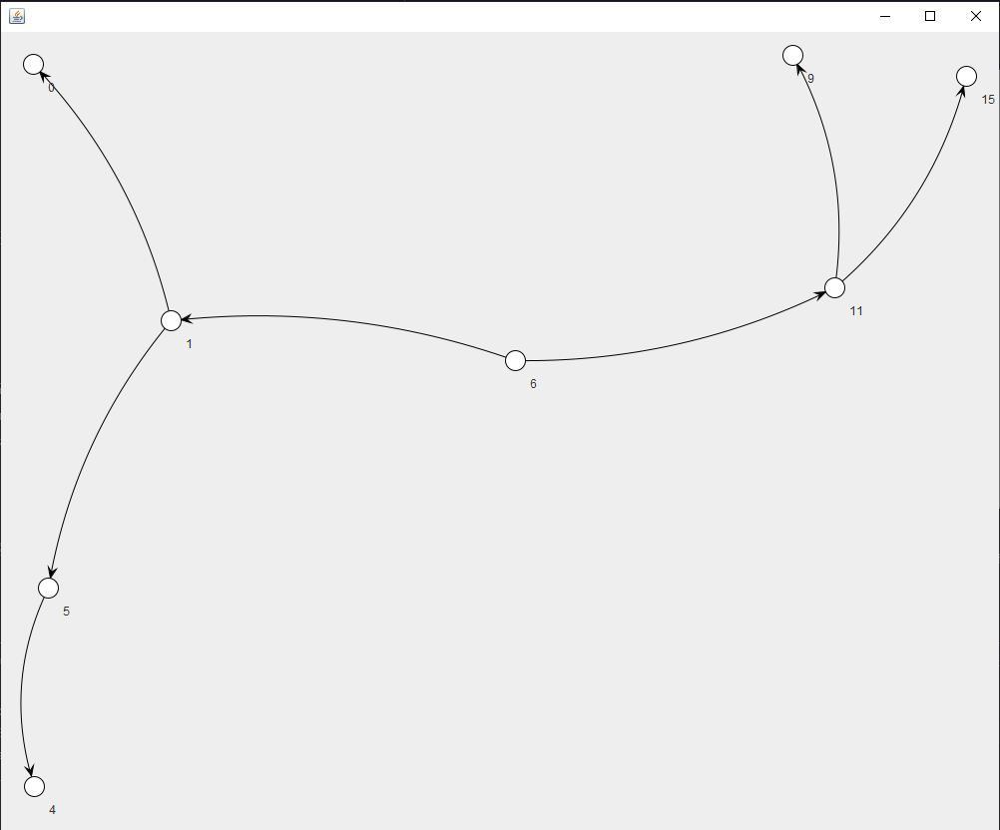
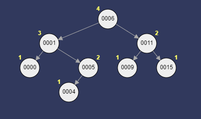

<h1 align="center">Árvore AVL</h1>

[Projeto](#projeto) &nbsp;&nbsp;&nbsp;|&nbsp;&nbsp;&nbsp; [Tecnologias](#tecnologias)
&nbsp;&nbsp;&nbsp;|&nbsp;&nbsp;&nbsp; [Licença](#license)

  

 
 

## 💻 Projeto 

Esse foi um projeto de uma atividade de Estrutura de Dados II, onde precisava implementar uma Árvore
AVL, onde cada nó pode ter no máximo dois filhos, sendo o de menor valor a esquerda e maior a
direita. A cada inserção ou remoção, a árvore precisa ser balanceada para os nós ficarem em seus
devidos lugares. A balanceamento é de acordo com a altura da árvore, que a diferença da altura da
subárvore esquerda menos a direita, sendo o resultado -1, 0 ou 1.

A parte gráfica desse projeto foi feita usando uma Biblioteca que fazia grafos, porém essa não foi
uma boa ideia, mas no dia foi a única que eu consegui implementar devido a incompatibilidade e
depreciações de algumas funções de outras bibliotecas. Logo após a apresentação, vi que tinha como
desenhar a árvore "manualmente", de modo que fosse necessário desenhar cada linha e nó.

 
 

Tela Inicial

 

Inseri os números 5,1,0,6,9,11,15,4 a árvore e cliquei para visualizar. A representação gráfica da
árvore é por meio de um grafo e não estrutura de uma árvore, como mostra as duas imagens a seguir:

 

 

Como mostra a imagem, ela balanceou toda a árvore, não mantendo ela na mesma ordem de inserção.

 

Expectativa

 
 

## 🚀 Tecnologias 

- Java
- Maven
- Java Swing
- Java awt
- Java Apache Batik
- Jung (Lib)

 
 

## 🔒 Licença

Esse projeto está sob a licença MIT.

